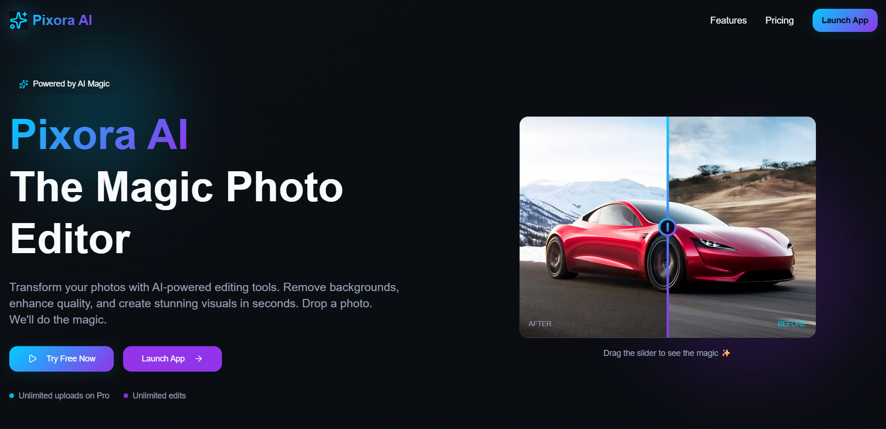

# Pixora - AI Image Editing Platform

Pixora is a modern AI-powered web application that provides advanced image editing capabilities, secure user authentication, and a subscription-based model for premium features. It offers seamless cloud storage and an embedded, interactive canvas-based image editor interface.

## Demo

Live demo: [https://pixora.vercel.app](https://pixora.vercel.app)

## Screenshots



## Features

- **Advanced Image Editor**: A powerful, interactive canvas-based editor with premium effects.
- **AI Processing**: Leverage advanced AI tools to enhance and modify your images.
- **Tiered Subscriptions**: Free and Pro plans handled securely via Stripe checkout.
  - **Free Plan**: Allows up to 3 generation/upload uses.
  - **Pro Plan**: Grants unlimited uploads and priority processing.
- **User Authentication**: Secure login and user management powered by NextAuth (Google OAuth).
- **Cloud Storage**: Seamless image uploading and asset management powered by ImageKit.

## Tech Stack

**Frontend**
- Next.js 14 (App Router)
- React 19
- TailwindCSS v4
- Shadcn UI & Radix UI
- Framer Motion

**Backend**
- Next.js API Routes
- Prisma ORM
- MongoDB

**Services & Infra**
- Stripe (Payments & Subscriptions)
- ImageKit (Image Hosting & Processing)
- NextAuth (Authentication)

## Installation

Clone the repository:

```bash
git clone https://github.com/yourusername/pixora.git
cd pixora
```

Install dependencies:

```bash
pnpm install
```

Generate Prisma Client:

```bash
pnpm exec prisma generate
```

Run the development server:

```bash
pnpm run dev
```

## Environment Variables

Create a `.env` file in the root directory and add the following necessary keys:

```env
# Database
DATABASE_URL="your_mongodb_connection_string"

# NextAuth
NEXTAUTH_URL="http://localhost:3000"
NEXTAUTH_SECRET="your_nextauth_secret"

# Google OAuth
GOOGLE_CLIENT_ID="your_google_client_id"
GOOGLE_CLIENT_SECRET="your_google_client_secret"

# Stripe
STRIPE_SECRET_KEY="your_stripe_secret_key"
NEXT_PUBLIC_STRIPE_PUBLIC_KEY="your_stripe_public_key"
STRIPE_WEBHOOK_SECRET="your_stripe_webhook_secret"

# ImageKit
NEXT_PUBLIC_IMAGEKIT_PUBLIC_KEY="your_imagekit_public_key"
NEXT_PUBLIC_IMAGEKIT_URL_ENDPOINT="your_imagekit_url_endpoint"
IMAGEKIT_PRIVATE_KEY="your_imagekit_private_key"
```

## Project Structure

```text
pixora/
 ├── app/            # Next.js app router pages and API routes
 ├── components/     # Reusable UI components (buttons, modals, navbar)
 ├── modules/        # Major page sections (Hero, Features, Pricing, Editor)
 ├── prisma/         # Prisma schema and database configuration
 ├── public/         # Static assets and images
 └── lib/            # Utility functions and configurations
```

## API Endpoints

- `POST /api/create-checkout-session` - Initializes Stripe checkout for Pro upgrades
- `POST /api/webhooks/stripe` - Handles Stripe webhook events for subscription updates
- `GET /api/upload-auth` - Generates authentication parameters for ImageKit uploads

## Deployment

Deploy using Vercel:

```bash
vercel deploy
```

## Future Improvements

- Add AI image generation (Text-to-Image)
- Improve caching and image load times
- Add community gallery to share edited images
- Implement advanced team collaboration features

## License

MIT
